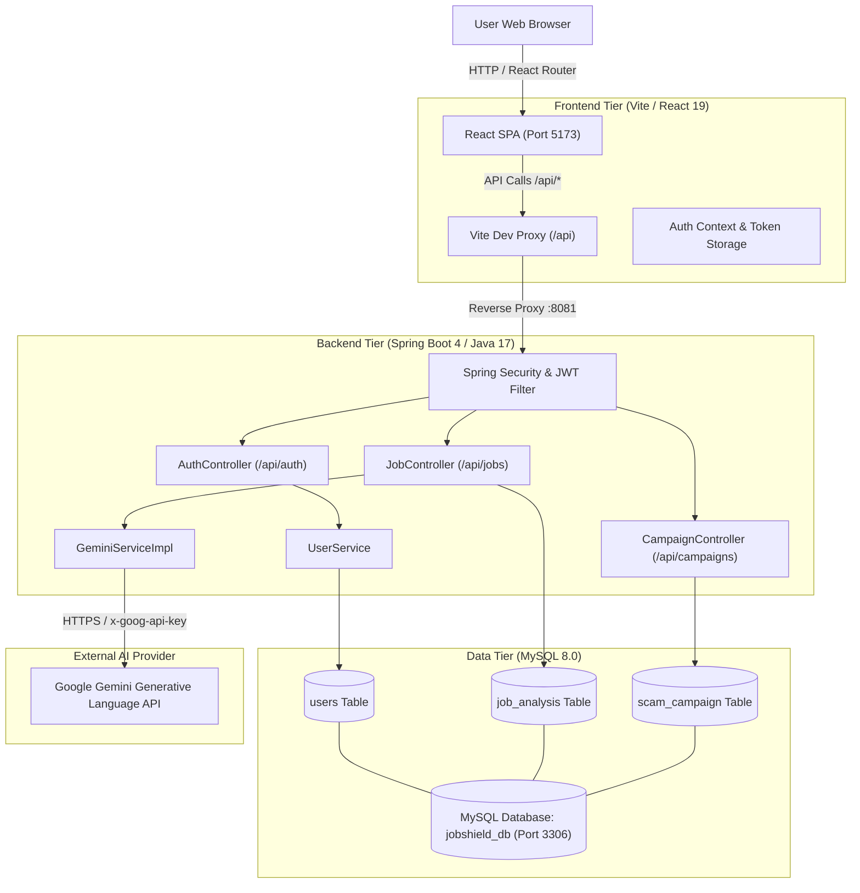

# JobShield System Architecture

This document describes the high-level architecture, module decomposition, network topologies, and data flows within **JobShield**.

---

## 1. High-Level Architecture Diagram

---

## 2. Ports & Network Connections

| Port | Service | Protocol | Access / Scope |
| :--- | :--- | :--- | :--- |
| **`5173`** | Vite Dev Server (Frontend) | HTTP | Host / Browser |
| **`8081`** | Spring Boot Tomcat Server | HTTP | Localhost / Internal Proxy |
| **`3306`** | MySQL Server 8.0 | MySQL Native | Localhost (HikariCP pool) |
| **`443`** | Google Gemini API Endpoint | HTTPS | Outbound Internet |

---

## 3. End-to-End Data & Request Lifecycle

### A. Authentication Flow (JWT)
1. User enters credentials at `http://localhost:5173/login`.
2. Frontend dispatches `POST /api/auth/login`.
3. Vite proxies the request directly to `http://localhost:8081/api/auth/login`.
4. Spring Security validates against `users` table via BCrypt.
5. On success, the backend mints a signed JWT containing username and roles (`ROLE_USER`).
6. Frontend stores the token in `localStorage` and includes it in subsequent requests as `Authorization: Bearer <token>`.

### B. Job Analysis Flow (AI Evaluation)
1. User submits raw job text or uploaded job content on `/analyze`.
2. Frontend dispatches `POST /api/jobs/analyze` with JWT in headers.
3. `JwtAuthenticationFilter` validates token signature and injects `SecurityContext`.
4. `GeminiServiceImpl` structures prompt injecting scam detection rules:
   - Upfront payment demands
   - Suspicious external communication channels (Telegram, WhatsApp)
   - Unrealistic compensation / low qualification requirements
   - Domain spoofing indicators
5. Request is dispatched to Google Gemini endpoint over HTTPS.
6. The AI response is parsed into:
   - `riskScore`: integer 0 to 100
   - `riskLevel`: `LOW`, `MEDIUM`, or `HIGH`
   - `reason`: contextual rationale
7. Results are persisted to `job_analysis` linked to `user_id`.
8. Visual payload is returned to the user interface.

---

## 4. Database Schema Structure

### `users`
- `user_id` (BIGINT, Primary Key, Auto-Increment)
- `first_name` (VARCHAR(50), NOT NULL)
- `last_name` (VARCHAR(50), NOT NULL)
- `email` (VARCHAR(100), UNIQUE, NOT NULL)
- `password_hash` (VARCHAR(255), NOT NULL)
- `phone_number` (VARCHAR(50), NULL)
- `role` (VARCHAR(50), NOT NULL)
- `account_status` (VARCHAR(50))
- `email_verified` (BIT(1))
- `created_at` / `updated_at` (DATETIME(6))

### `job_analysis`
- `analysis_id` (BIGINT, Primary Key, Auto-Increment)
- `user_id` (BIGINT, Foreign Key)
- `job_title` (VARCHAR(255))
- `company_name` (VARCHAR(255))
- `salary` (VARCHAR(100))
- `job_description` (TEXT)
- `risk_score` (INT)
- `risk_level` (VARCHAR(20))
- `ai_reason` (TEXT)
- `scam_pattern` (VARCHAR(255))
- `campaign_id` (BIGINT, NULL)
- `created_at` (DATETIME(6))

### `scam_campaign`
- `campaign_id` (BIGINT, Primary Key, Auto-Increment)
- `campaign_name` (VARCHAR(255))
- `company_name` (VARCHAR(255))
- `target_role` (VARCHAR(255))
- `description` (TEXT)
- `reported_count` (INT)
- `status` (VARCHAR(50))
- `created_at` (DATETIME(6))

---

## 5. Security & Resilience Considerations

- **Input Validation**: Jakarta Bean Validation (`@Valid`, `@NotBlank`, `@Size`, `@Email`) prevents malformed data before reaching business layers.
- **Connection Resilience**: HikariCP handles database reconnection and pool leasing automatically.
- **Stateless Session**: The server maintains zero session state in memory, allowing horizontal scaling behind load balancers.
- **Data Protection**: Passwords are hashed with `BCryptPasswordEncoder` (10 rounds standard).
